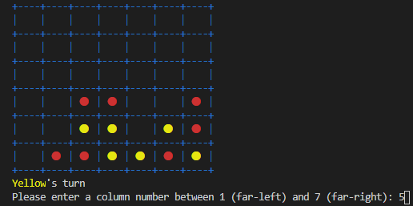
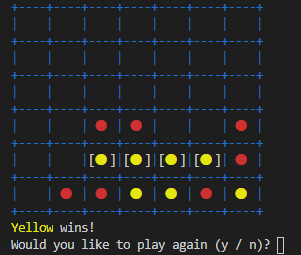

# Command-Line Connect Four
A command-line implementation of Connect Four written in Ruby
## Gameplay

From [Wikipedia](https://en.wikipedia.org/wiki/Connect_Four):

>Connect Four is a two-player connection board game in which the players first choose a color and then take turns dropping one colored disc from the top into a seven-column, six-row vertically suspended grid. The pieces fall straight down, occupying the lowest available space within the column. The objective of the game is to be the first to form a horizontal, vertical, or diagonal line of four of one's own discs." 

This command line app has players enter a column number between 1 and 7 to indicate into which column they wish to drop their disc:

The game ends when one player gets four in a row, at which point the players get the option to play again. The losing player of one round will go first in the next round:

